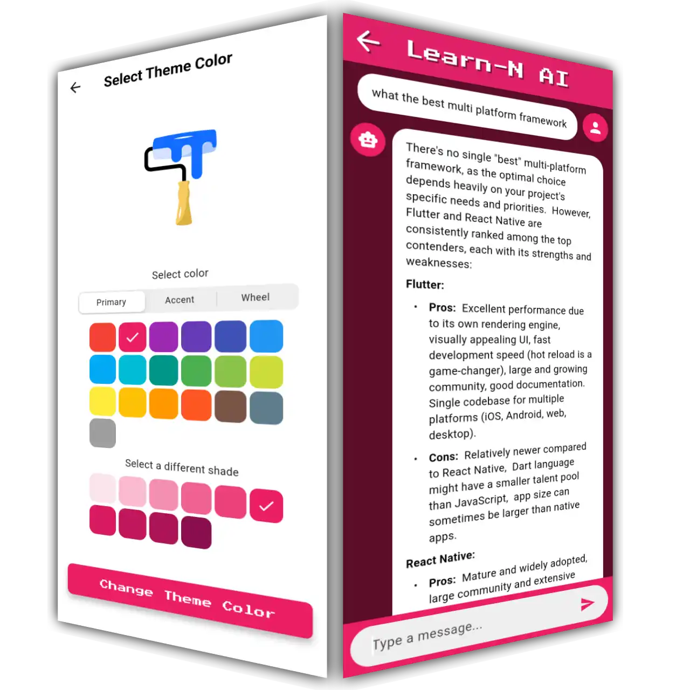
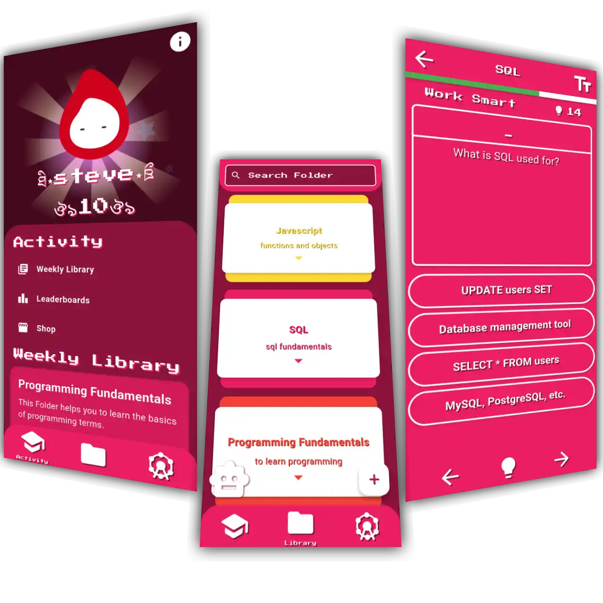

<h1>Learn-N</h1> 

  
  
   
  <b>Master any subject with Active Recall learning</b>

## 🚀 Overview

Learn-N is a intuitive study companion designed to help students effectively master any subject through Active Recall - one of the most scientifically-proven techniques for long-term information retention. Whether you're studying programming or any other topic, Learn-N transforms your learning experience.

## ✨ Key Features

### 📚 Weekly Library
Access structured learning materials organized by subject, from Programming Fundamentals, all presented in an easy-to-navigate interface.

### 🤖 Learn-N AI Assistant
- Get instant answers to your questions
- Generate quizzes automatically from your study materials
- Receive explanations and clarification on complex topics
- Study with an AI tutor that adapts to your learning needs

### 📝 Customizable Quizzes
- Create your own personalized quizzes
- Practice with automatically generated questions
- Track your progress and identify weak areas
- Reinforce knowledge through spaced repetition

### 🎨 Personalization
- Choose your own theme colors
- Customize your learning environment
- Create a study experience that works for you

## 🛠️ Technology

Learn-N is built using modern development frameworks, offering a seamless experience across multiple platforms:
- Flutter for cross-platform compatibility
- AI-powered quiz generation and assistance
- Clean, distraction-free UI designed for focus

## 💯 Why Learn-N?

- **Zero Advertisements**: Focus entirely on your studies without distractions
- **Active Recall**: Leverage the most effective study technique backed by cognitive science
- **AI Assistance**: Get help exactly when you need it
- **User-Friendly Design**: Intuitive interface requires no learning curve
- **Customization**: Tailor the app to your preferences and study habits

## 🤝 Contributing

Contributions are welcome! Please feel free to submit a Pull Request.

## 📬 Contact

Questions? Suggestions? Reach out to urielvuelta@gmail.com

## 📄 License

This project is licensed under the GNU General Public License v3.0 – see the LICENSE file for details.

---

  <i>With Learn-N, learning is not just easier—it's also fun!</i>

